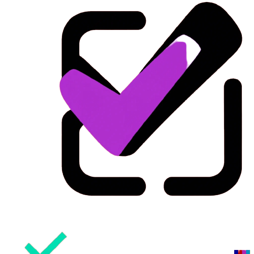

# CheckLit

A FAC project using test-driven-development methods. ``CheckLit`` is an online check list tool that users can update and modify.

### Purpose

The purpose of this repo is to document and collaborate on ``CheckLit`` using asynchronous working methods.

### User stories

As a user, I want to:
- Create and view multiple checklists
- Add and delete items from my lists
- Mark items as completed
- Remove entire lists from the page
- View checklists on all my devices

### Instructions

- Download CheckLit files
``git clone https://github.com/fac27/CheckLit main``
- Open CheckLit files in your editor
- Install vsCode ```LiveServer``` or equivalent to view the CheckLit UI. Alternatively, open ```index.html``` from your local library.

<a style="text-align:center" href="fac27.github.io/CheckLit/">fac27.github.io/CheckLit/</a>

*Web link not ready for use, please follow local access instructions above*

### Learning objectives

#### Testing 
[x] Check that passing a given input into our tests returns the expected output

[x] Write tests to mimic the behaviour of a user performing different action

#### JavaScript 
[x] Write testable, modular functions

[x] Write functions that add, remove or modify DOM nodes

[x] Apply event listeners to HTML form elements

[x] Use scope to control what variables are accessible inside functions and blocks

#### Design 
[x] Use CSS grid to create complex layouts

[x] Use CSS grid to make layouts that adapt to the viewport size


### Planning

We took inspiration from ``Google Keep``
[Google-keep](Img/google-keep.png)

Create a logo using DALL.E




Sketch a design using [Miro](https://miro.com/app/board/uXjVPhyAlD0=/)


